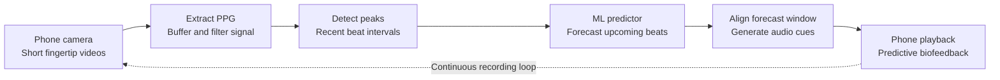

  <h1>Heart Biofeedback</h1>
  
<strong>Predicting the next heartbeat to bridge processing latency</strong>

  
Machine learning × cognitive science · University practicum

  
Python · PyTorch · Flask · OpenCV · SciPy · Flutter

## The idea

Developed during a practicum in **Prof. Amir Amedi’s Brain Lab at Reichman University**, Heart Biofeedback brought together two fields I studied at university: **machine learning and cognitive science**. The project explored how camera-based pulse sensing and predictive audio feedback could support interoception—the perception of internal bodily signals.

The central challenge was timing. By the time a fingertip video has been captured, uploaded, and processed, the detected heartbeat is already in the past. Playing that beat immediately would produce delayed feedback. Instead, a model uses recent heartbeat timing to **forecast upcoming beats**, creating audio cues intended to feel live despite the processing delay.

This is predictive biofeedback: the cues estimate future timing rather than guarantee synchronization with each actual heartbeat.

[Watch the app demo →](https://www.youtube.com/shorts/ZayBn7RVBaY)

## From camera to feedback

The latest backend combines successive video segments into a signal window, checks readability, detects peaks, and predicts future peak times. It selects an upcoming portion of the forecast and returns a WAV track of scheduled beeps. This shifts the feedback target forward in time to accommodate the capture–processing–playback pipeline.

## Three purpose-built models

Three neural networks were built and trained during the practicum to address **signal quality, missing data, and future beat timing**. The diagrams combine illustrative signals with the actual layer sizes; signal sketches are conceptual examples, not evaluation results.

**Implementation note:** the saved models are multilayer perceptrons (**MLPs**), despite legacy files named “TCN” and “Unet.” Classification and reconstruction belong to earlier experiments; the latest revision uses conventional signal preparation and retains the learned predictor.

### 1 · Signal-quality classification

A window classifier learns to distinguish usable PPG from unreliable segments. Its sigmoid output provides a binary quality decision; a separate processing step can mask the region selected for reconstruction. It was trained on labeled signal windows.

### 2 · Missing-signal reconstruction

The reconstruction network receives a ten-second signal with a two-second region zeroed out and estimates the **48 missing samples** at 24 Hz. Training creates these gaps in clean recordings and uses the original removed segment as the target, optimizing mean squared error. Inserting that estimate completes the waveform for subsequent processing; reconstructed samples remain estimates.

### 3 · Future-peak prediction

The predictor receives **eight recent intervals paired with eight relative peak times**. Its fully connected layers map those 16 values to eight future peak times. Training uses past/future timing pairs with a Smooth L1 loss. The backend aligns the forecast to the latest detected beat and converts the selected future times into audio cues.

## Prediction in practice

The original signal plot shows **detected peaks as red crosses** and **predicted timings as green dots**, alongside the clean and filtered PPG waveforms. Their horizontal separation makes prediction timing error visible; the example illustrates the forecasting approach rather than an aggregate accuracy claim.

## Explore the implementation

[Video-to-feedback pipeline](video_route.py) · [Prediction network](predict_model.py) · [Signal processing](filter_and_peaks.py) · [Audio generation](create_sound.py) · [Model history and training notes](docs/model-notes.md)
